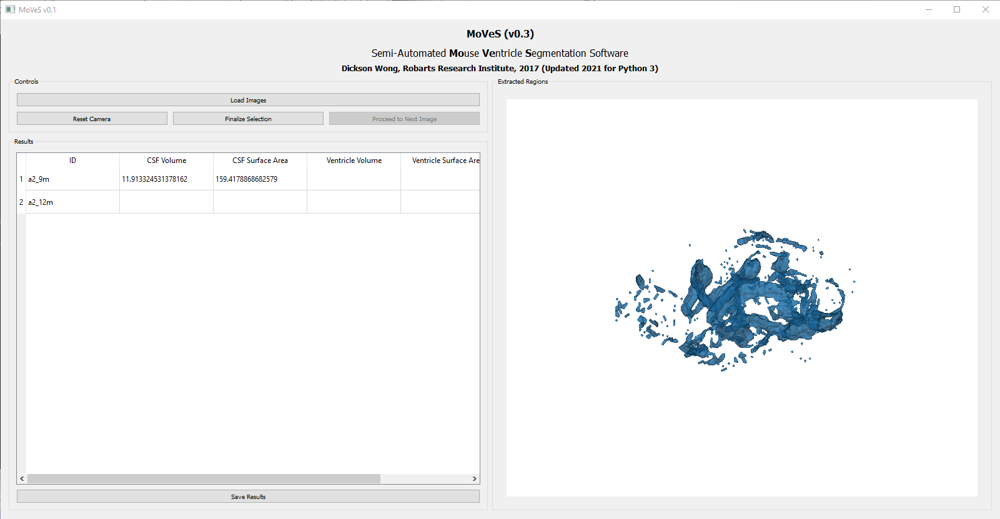

# MoVeS
MoVeS is a semi-automated **Mo**use **Ve**ntricle **S**egmentation software that allows you to estimate CSF volume, CSF surface area, ventricle volume, and ventricle surface area given NIFTI images of mouse brains.

## Installation
MoVeS is a Python 3 application that utilizes SciPy and VTK libraries for image processing and PyQt for GUI elements. This application was developed on a Ubuntu machine and works best in a Linux environment. It also seems to work in Windows 10 natively as well as in Ubuntu running on the Windows Subsystem for Linux with VcXsrv to render the GUI. Theoretically, it should install and run on a Mac, but I've not tried it.

### Python

#### Windows 10
Download and install Python 3.7.7 or later for Windows 10 from [here](https://www.python.org/downloads/windows/). During the installation, make sure ...

* ... you check the "Add to Path" box
* ... you install pip

#### Ubuntu
Python 3 should be the default version of Python on the latest version of Ubuntu. Before you continue, ensure your Ubuntu packages are up-to-date by running:
```
sudo apt update
sudo apt upgrade
```

### Supporting Libraries
In a Windows terminal or a Ubuntu terminal, run the following commands. _Note that you may need `sudo` privileges on Ubuntu or administrator privileges on Windows._
1. Install PyQt5.
```
pip install PyQt5
```
2. Install scipy and numpy.
```
pip install scipy
```
3. Install VTK.
```
pip install vtk
```
## Usage

To run the program, navigate to the folder where the software is located in a Ubuntu or Windows terminal. Type `python main.py` to run the program.

## Loading Images
Load an image by clicking the `Load Images` button. You may select multiple images. The program expects an image with the suffix `*_std_brain_csf.nii.gz`. See the `/test` folder for example images.

A `*_std_brain_csf.nii.gz` image is generated using the following general steps:

1. Re-orientation of the acquired MRI image such that it is in the appropriate orientation. Often, because animals are prone during acquisition, while humans are supine, typical assumptions about the orientation of the animal in the MRI are wrong.

2. Strip the skull and other non-brain structures from the image.<br><br>
_A re-oriented and skull-stripped image of a mouse brain. Notice how the orientation labels are correct._</img>

3. Extract only the CSF voxels from the skull-stripped image.<br><br>
_The CSF-only voxels have been identified._</img>

After an image has been loaded, the total CSF volume and surface area of all CSF spaces are estimated, and a 3D model is generated of all the CSF spaces.<br><br>
</img>

## Navigate the Model
Use your mouse to navigate the 3D model and select the CSF spaces pertaining to the ventricles:
* **Right clicking and dragging** will zoom the model in and out. Alternatively you can use your **mouse scroll wheel**.
* **Left clicking and dragging** will rotate the model.
* A **single left click** on a CSF space will select it. A selected CSF space is turns red.
* To deselect a selected CSF space, use a **single right click** on the selected CSF space.
* A **single right click** on the background will redraw the model.

</img>

To reset your view of the model, hit the `Reset Camera` button and right click on the background to redraw the model.

## Finalize Selection
Hit the `Finalize Selection` button to finalize the selection. You'll notice the camera reset, remove regions you did not select, and output a `*.png` file capturing the view of the 3D model. You'll also notice the "Ventricle Volume" and "Ventricle Surface Area" fields populate in the table. These numbers represent the volume (in mm<sup>3</sup>) and the surface area (in mm<sup>2</sup>) of the selected regions.

</img>

Proceed to the next image in the list by hitting the `Proceed to Next Image` button. Then right click on the background to update the view and draw the next model.

## Save Results
Hit the `Save Results` button to save a copy of the table in `*.csv` format.


